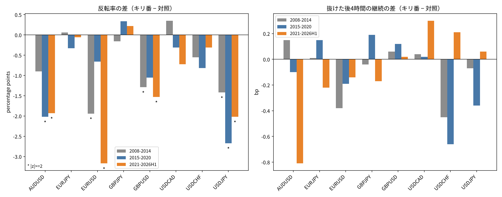
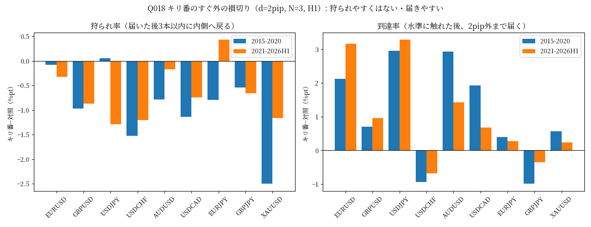

# 為替のキリ番は「跳ね返る場所」ではなく「抜けやすい場所」

**結論: 支持。** キリのいい価格（下2桁00・50）に届いた1時間足は、対照の価格（25・75）より跳ね返りにくく、むしろ終値で抜けていく割合が1〜3%ポイント高い。損切りをキリ番の少し外に置く実務の言い伝え（「狩られやすいからずらす」）も、1時間足では根拠がないことを確認した。

Osler (2003) の「利食い注文はキリ番に集まりトレンドを止める／逆指値はキリ番のすぐ外に集まりトレンドを加速させる」という市場構造の説明の、2015年以降のデータでの追試。

## 検証の流れ（3段階）

### 1. キリ番は跳ね返るか（反転率・継続）

主要8通貨のH1（Dukascopy 2008–2026H1）。前足の終値から最も近いキリ番（00・50）と対照（25・75）に、当該足の高値・安値が届いた事象について、終値が手前に戻った割合（反転率）と、抜けた後4本の値動き（継続）を比較。

- 反転率はキリ番の方が**低い**（8通貨中6〜7で負、2021–2026H1はz<−2が4通貨）。事前仮説（キリ番の方が反転しやすい）とは逆向き
- 抜けた後の継続には明確な差はない

### 2. 独立データでの追試（金・銀・15分足）

金XAUUSD・銀XAGUSD（通貨と独立した市場）と、USDJPY・EURUSDのM15（時間足だけ変えた準独立データ）で同じ反転率の差を測定。

- 6系列すべてで差＜0、|z|≥2が4系列 → **支持**（最初の発見が1時間足・為替に固有の見かけでないことを確認）

### 3. 損切りの置き場所への応用（キリ番のすぐ外は狩られやすいか）

キリ番のすぐ外 d pip（主指標2pip）に仮想の損切りを置いた場合、届いた後に価格が内側へ戻る割合（狩られ率）と、そもそも届く割合（到達率）を比較。

- 狩られ率はキリ番の方がむしろ**低い**（9銘柄中0が正、z>2は一度もない）
- 到達率はキリ番の方が高い（1〜3%ポイント、Osler仮説と整合）
- **判定: 棄却**（「キリ番の外は狩られやすい」という言い伝えには1時間足で根拠がない）。15分足での確認（`kensho_stophunt_m15.py`）でも同じ結論

## コード・データ

| スクリプト | 内容 |
|---|---|
| [`kensho_roundnumber.py`](./kensho_roundnumber.py) | 段階1: 反転率・継続（8通貨H1） |
| [`kensho_roundnumber_oos.py`](./kensho_roundnumber_oos.py) | 段階2: 独立データ追試（金・銀・M15） |
| [`kensho_stophunt.py`](./kensho_stophunt.py) | 段階3: 損切りの狩られ率・到達率（H1） |
| [`kensho_stophunt_m15.py`](./kensho_stophunt_m15.py) | 段階3の15分足での確認 |

生データ（Dukascopy H1/M15）は本リポジトリに含めていません。集計済みCSVは`output/`にあります。

## 限界

- 1時間足・15分足の終値で判定しており、足の中の動き（数分で刺して戻す「ヒゲだけの狩り」）は見えない
- 抜けやすさの差は小さく（1〜3%ポイント）、コスト込みで売買の利益になるかは未検証
- データは1系列（bid想定）。bid/askを分けた測定はしていない
