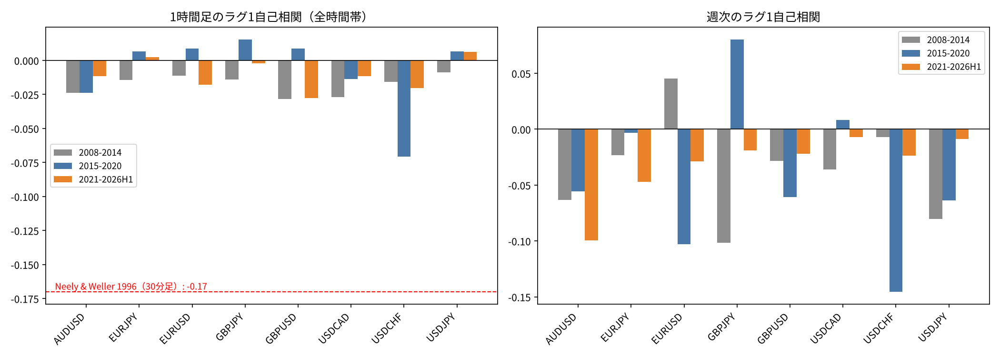

# 為替の超短期平均回帰は2015年以降の1時間足では消えたか

**結論: 消えた（支持）。** 1996年前後に報告された超短期リターンの強い負の自己相関（平均回帰）は、2015年以降のどの通貨ペア・時間足でも0と有意に区別できない。

## 背景・仮説

Neely & Weller (2003) ほかが報告した「為替の30分足には強い負の1次自己相関があり、非同期取引やbid/ask跳ね返りでは説明できない」という結果（参考値: ラグ1自己相関 −0.17）の追試。

事前に固定した仮説:
- 1時間足のラグ1自己相関は負（平均回帰）
- 週次のラグ1自己相関は正（トレンド）
- 判定は2015年以降のデータに限る（1996年の報告から約20年、市場構造の変化を見るため）

## データ・手法

- 主要8通貨ペア（EURUSD, GBPUSD, USDJPY, USDCHF, AUDUSD, USDCAD, EURJPY, GBPJPY）
- Dukascopy H1、2008年〜2026年H1を3期間（2008–2014 / 2015–2020 / 2021–2026H1）に分割
- 各期間・各ペアでラグ1自己相関と、不均一分散に頑健なt値を算出。週次リターンも同様に測定
- 2021–2026H1のみ、EURUSD・USDJPYでM15（15分足）も測定（30分足のデータがないための代用）

コード: [`kensho_autocorr_timescale.py`](./kensho_autocorr_timescale.py)　生データ: `data_*_H1_dukascopy.csv`（本リポジトリには含めず。検証を再現する場合はDukascopyから取得してください）

## 結果

| 指標 | 2008–2014 | 2015年以降（16系列） | 参考: Neely & Weller（1996年前後・30分足） |
|---|---|---|---|
| H1自己相関（全時間） | 8通貨中8で負（−0.008〜−0.029）。\|t\|≥2 は2系列 | 負10/16、**\|t\|≥2 は0** | −0.17（全時間） |
| H1自己相関（07–20 UTC） | 負6/8 | 負10/16、\|t\|≥2 は0 | − |
| M15（2021–2026H1） | − | EURUSD −0.020（t=−3.1）、USDJPY −0.005（t=−0.4） | − |
| 週次自己相関 | 負7/8 | 負13/16、\|t\|≥2 は0（正のトレンドは見られない） | 「週次・月次は強いトレンド」（著者の見解） |

EURUSDのM15だけ統計的に有意（t=−3.1）だが、予測できる値動きは1本あたり約0.08bp（H1の値動き中央値の約1/50）で、スプレッドに比べて桁違いに小さく実運用には使えない。

## 限界

- 16系列で検定しており、1つだけ \|t\|≥2 が出ても多重比較を考えると偶然の範囲内（データスヌーピング補正はしていない）
- データはDukascopyの1系列（bid想定）。bid/askを分けた測定はしていない
- 1996年〜2008年の間にどこで効果が消えたかは、このデータ（2008年〜）からは分からない

## 次への示唆

「直前と逆に張る」という無条件の逆張りには優位性がない。優位性があるとすれば、水準（キリ番など）や時間帯など条件付きの構造の方にある、という見立てで次の検証（キリ番の反転・継続率など）につなげた。
